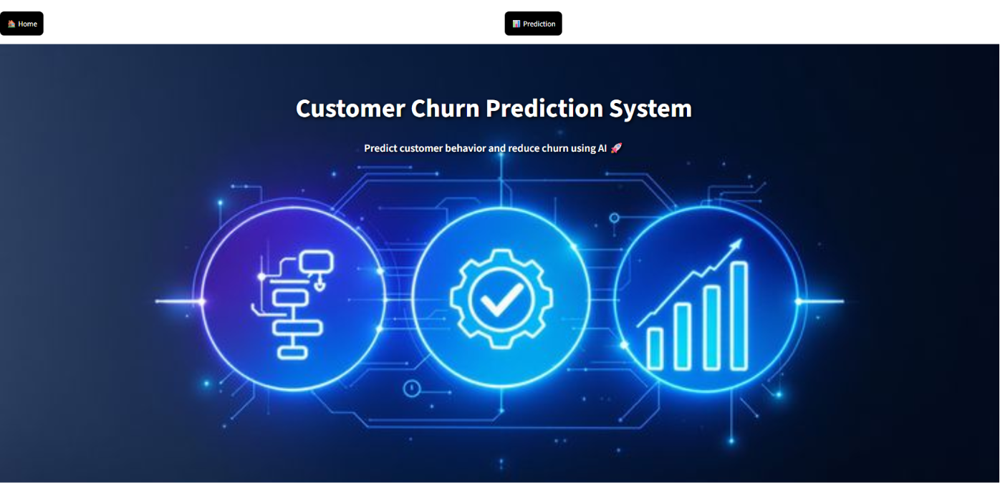
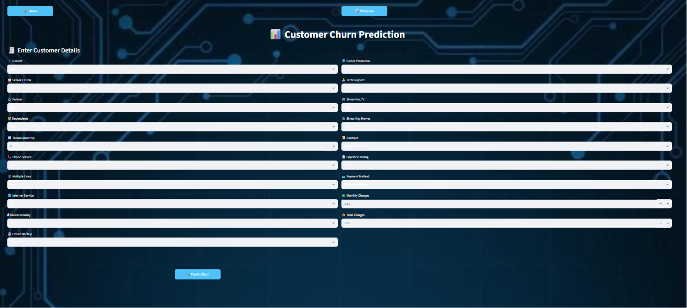

# 📊 Customer Churn Prediction System

An end-to-end Machine Learning project that predicts whether a customer is likely to churn based on service usage and demographic data. The project includes a fully interactive web application built using Streamlit with a modern UI and navigation system.

---

## 🚀 Live Demo

🔗 https://customer-churn-prediction-mn9jgcrrsgawbitrkswb3x.streamlit.app/


---

## 📌 Features

* 🧠 Machine Learning model for churn prediction
* 🎯 Real-time prediction based on user inputs
* 🎨 Clean UI with homepage and navigation buttons
* 📊 Structured input layout (2-column design)
* ⚡ Fast and responsive Streamlit app
* 🌐 Deployed and accessible online

---

## 🛠️ Tech Stack

* **Programming Language:** Python
* **Libraries:** Pandas, NumPy, Scikit-learn
* **Framework:** Streamlit
* **Tools:** Git, GitHub

---

## 📂 Project Structure

```
├── app1.py
├── customer_churn_model.pkl
├── requirements.txt
├── homepage.png
├── background.png
└── README.md
```

---

## ⚙️ How to Run Locally

1. Clone the repository:

```bash
git clone https://github.com/your-username/your-repo-name.git
cd your-repo-name
```

2. Install dependencies:

```bash
pip install -r requirements.txt
```

3. Run the app:

```bash
streamlit run app1.py
```

---

## 🧠 Model Details

* Algorithm used: Machine Learning Classification Model
* Data preprocessing: Encoding and feature alignment
* Prediction output:

  * ⚠️ High Churn Risk
  * ✅ Low Churn Risk

---

## 📸 Screenshots

### 🏠 Homepage



### 📊 Prediction Page



---

## 💡 Future Improvements

* Add more features for better prediction accuracy
* Integrate Deep Learning models
* Enhance UI with animations
* Add user authentication

---

## 🙋‍♀️ Author

**Sangeeta Dhankhar**
📍 Haryana, India
🔗 GitHub: https://github.com/sangeetadhankhar10
🔗 LinkedIn: https://linkedin.com/in/sangeetadhankhar

---

## ⭐ If you like this project

Give it a ⭐ on GitHub and feel free to connect!
